# Guide to Scraping Data from Website to Excel with Web Query

In this article, we will learn how to implement a web scraper in Excel with Web Query. We will first explore the basics of Excel Web Scraping. After that, we will also write an excel scraper using Web Query to retrieve data into excel. So, let’s get started.

## How web scraping in Excel works

Microsoft Excel has a powerful built-in feature to extract data from websites. It is called `Web Query`.  Web Query allows users to perform web scraping and collect data from the Internet automatically or with a few button clicks. If your target website contains a static table and you have a computer running Microsoft Excel with an active Internet connection, you are good to go!

The Microsoft Web Query uses the Operating System’s Web Browser usually Internet Explorer in older Windows and Edge in the latest ones to load the website. This gives Web Query the ability to render Modern Javascript websites without any issues. Once the website finishes loading the Web Query will automatically parse the whole page and find all the relevant static HTML Tables available on the current page. It will highlight all of the tables and make them selectable. Once the user picks the desired table, a Web query will help the user to extract the table data without altering the formats or dimensions.

## How to scrape website data using Excel web queries

Now that we’ve learned what Web Query let’s scrape some data from the Internet. We will scrape the `books.toscrape.com` website and extract the book’s data and save it to an excel spreadsheet. We will also learn and explore various web query features along the way. Before we begin, we need to make sure:

- We have an Active Internet Connection
- We have Microsoft Office Installed so that we can use Microsoft Excel. If you don’t have Microsoft Office you can download and install it from [here](https://support.microsoft.com/en-us/office/download-and-install-or-reinstall-microsoft-365-or-office-2021-on-a-pc-or-mac-4414eaaf-0478-48be-9c42-23adc4716658)

Once you have Microsoft Office installed, you can follow the below steps:

### Step 1: Open a blank Spreadsheet

Open a blank spreadsheet in Microsoft Excel and click on `Data` from the menu.

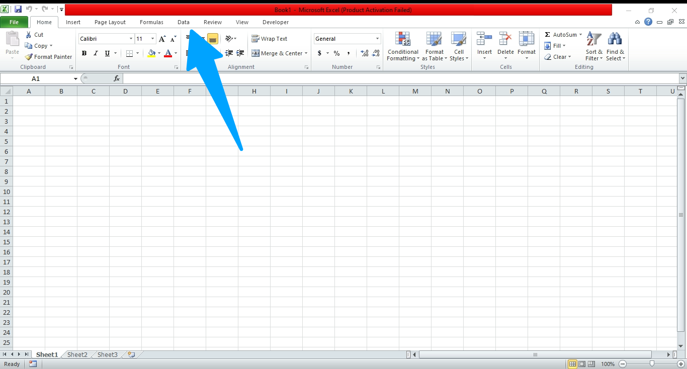

### Step 2:  Click on from web

Once you click on `Data` it will show new menu items with a variety of options for extracting data. From there pick `From Web` and click on it. It will open a new Window.

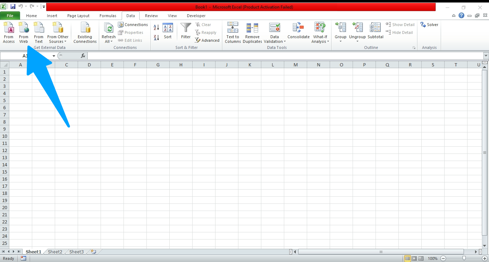

### Step 3: Type the URL in the address bar and click Go

You will see an Address bar in the `New Web Query` window. In this text box, type the URL: `https://books.toscrape.com` and click Go.

### Step 4: Navigate to the Book page

It will load the website in the mini Web Browser. You can interact and browse the website here. Scroll down and click on a book link to open the book page

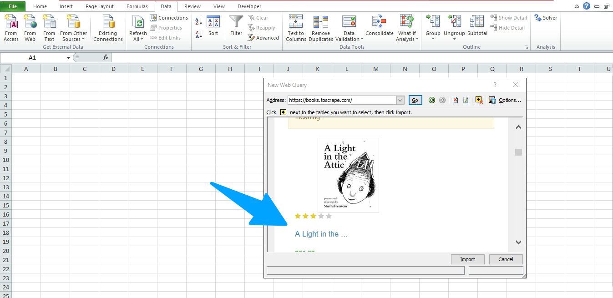

### Step 5: Select the desired Table to scrape

On the book page, you will find a table if you scroll down a bit. There will be a small yellow arrow icon that you can click. Clicking the button will select the table associated with it. Click on it. Once the table is selected click on the `Import` button below.

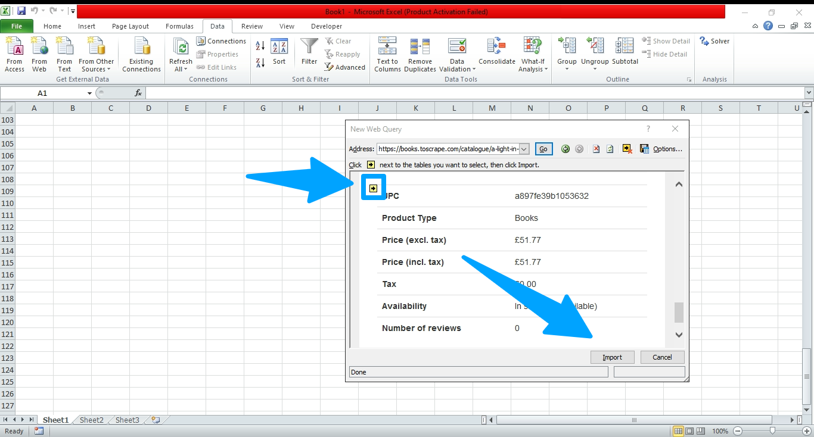

### Step 6: Select "existing worksheet" and click ok

When you click the Import Button a small window will appear similar to the below screenshot. Make sure Existing Worksheet is selected and click `OK`:

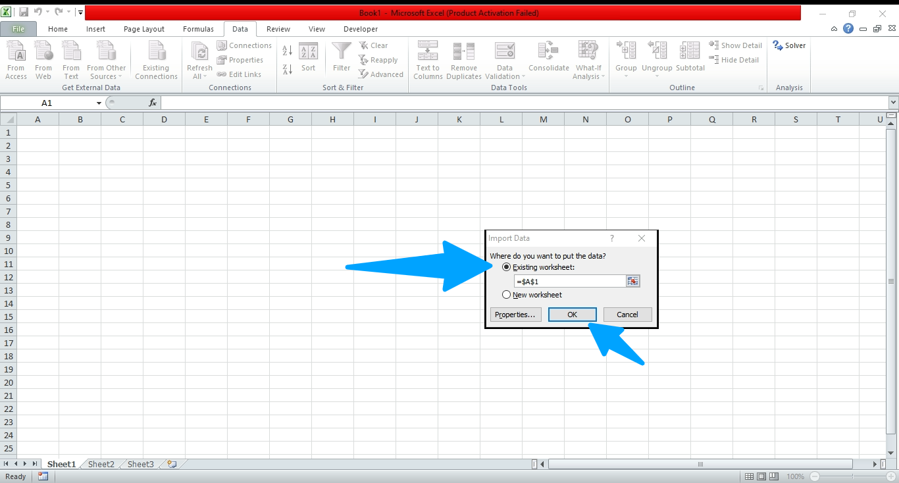

and that’s it! The Web Query will create a background process to run the web query and fetch the website. After fetching the website, it will parse the table and extract the text into the excel columns. The output will be similar to below.

## Output

You can match it with the website and validate all the data from the table are correct.

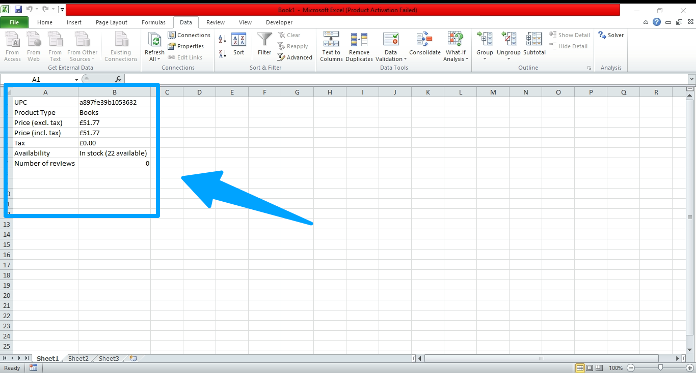

All the columns and rows will be linked to the web query so whenever we refresh the data manually or automatically Microsoft Excel will know which rows or columns to update. In the next section, we will explore multiple ways to Refresh & Update Data.

## How to Update and Refresh Data

There are mainly 2 different refreshes available for the Web Query.

- Automatic
- Manual

In the automatic mode, Excel will periodically pull the data in the background and keep the sheet up to date. We can customize the duration which will see in a few moments. Before we do this, we will explore multiple ways of doing Automatic updates and Manual refreshes of the data.

First, let’s delete a few items from the existing data so that we can validate the refresh works as expected.

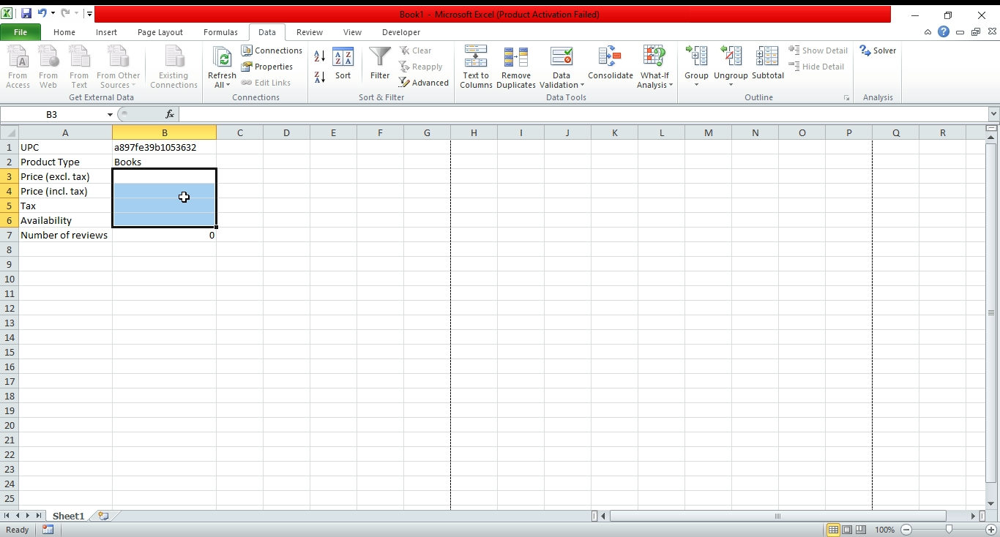

Notice, we removed price, tax, and availability from the data.

### Option 1: Click Refresh from the Top menu

On the top menu under the Data Submenu, there is a button named `Refresh`. We can pull the latest data by clicking this button or we can press the shortcut `CTRL + ALT+ F5`. Once we click the `Refresh` The missing values of Prices, tax & Availability get refreshed with the latest prices, tax & availability respectively.

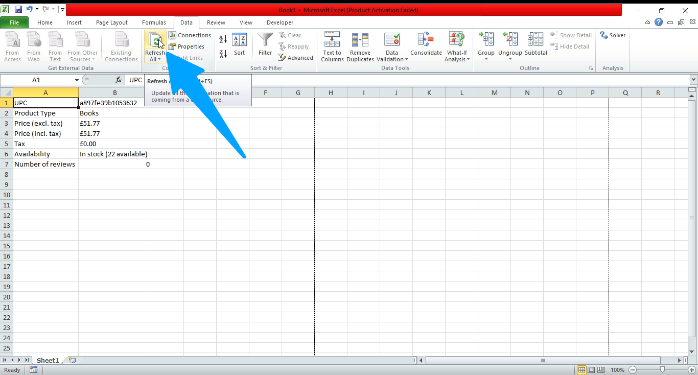

### Option 2: Refresh from the context menu

Let’s remove a few fields again to test an alternate way of data refresh. This time, we will use the `Refresh` button of the context menu instead of the Menu button. First, we will have to `right-click` on a cell and select `Refresh`. Note that, we will have to click cells that get updated by the web query. If we click on the other cells that are not part of the web query update this `Refresh` button won’t show up.

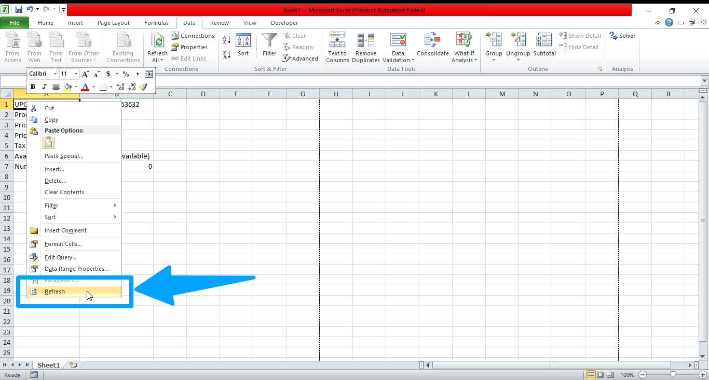

### Option 3: Edit & Rerun the Query

Now we will remove some fields again and then try another method of updating the data. After removing some data. Right Click on the cell, it will show an option `Edit Query`

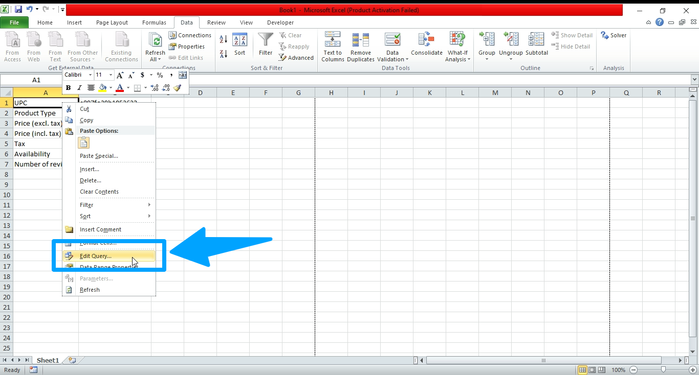

Click on it.

It will open a new window `Edit Web Query`. From this window, If we click import, The web query will run a background process to fetch the latest updates from the website and refresh the existing data, replacing old data with new data.
[!option 3 b](Images/11_clickimport.png)

This method is useful if we want to update the scraper e.g. changing the website URL, updating the query to fetch a different table or page, etc.

Now, let’s learn how to avoid manual refresh and automate the whole refresh/update process.

## Configure Automatic Refresh from Properties

The steps are pretty simple. First, we will open the context menu again by right-clicking on a cell associated with a web query. From the menu, we will select Data Range Properties.

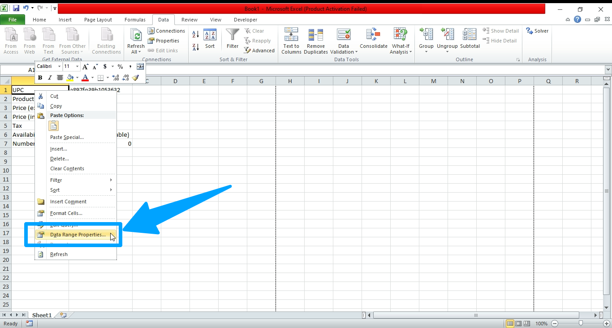

This will open up the `External Data Range Properties` window similar to the below:

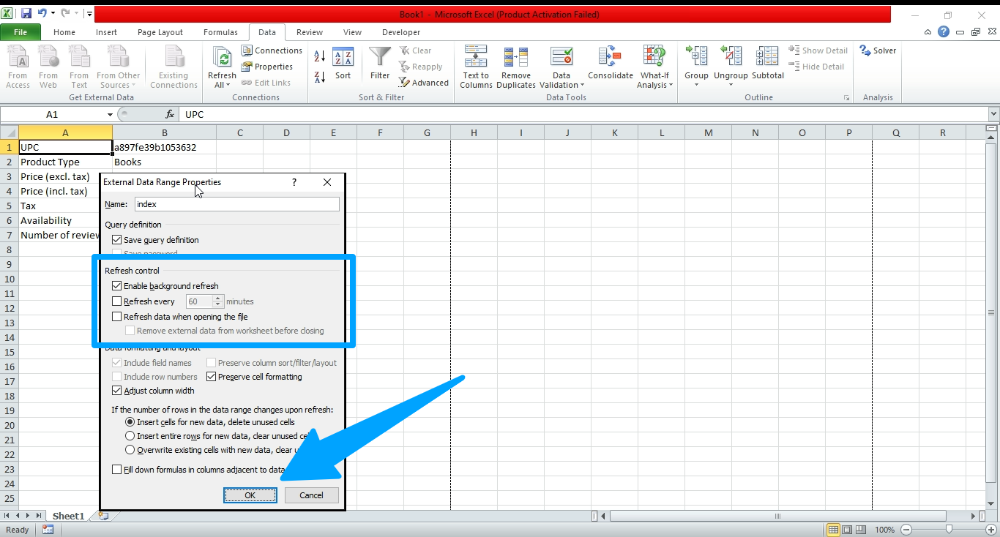

Here we are looking for the Refresh Controls. By checking these checkboxes we can automatically refresh the data. Go ahead and check the `Enable background refresh`. And then using the second checkbox we can tell excel to refresh data periodically after some time. So for example, if we set it to refresh after every 5 minutes. Excel will automatically pull the data every five minutes using a background process and update the table automatically.
We won’t have to click any buttons.

If we check the third checkbox `Refresh data when opening the file`. Every time we open the spreadsheet excel will pull fresh data for us.

## Conclusion

Let’s revisit what we’ve learned so far. Web Query makes web data extraction a breeze in Excel, especially for websites with tables. It enables us to automate simple tasks and extract web data with less or no interaction.  Web Query also allows us to scrape data from dynamic websites with Javascript.

Before wrapping it up, We must take note of a few things. Web Query is not suitable for developing custom sophisticated web scrapers. For example, web scrapers that require login, interaction with button or web elements, proxy integration to do a large-scale scraping, etc. are almost impossible to accomplish using Web Query.

In such cases, we have multiple alternatives such as developing Web Scraper using Python, Javascript or Go. Especially, Python Programming language is popular for developing Large Scale Cross Platform web scrapers. Google App Script and Google spreadsheet combination can be another option.  Last but not least, we can also use VBA script to interact with websites from Excel however, it is not as flexible as the other options that we’ve mentioned earlier.
